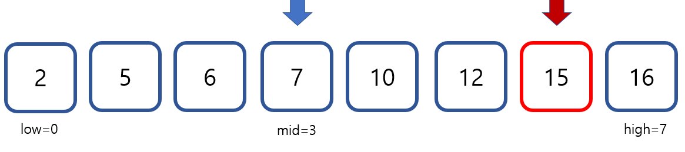
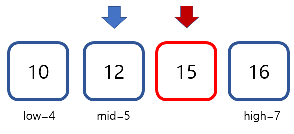
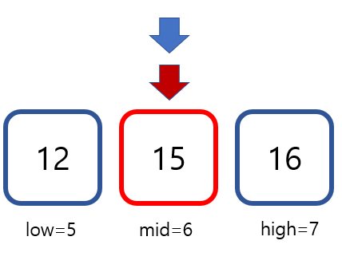

# Binary Search
정렬되어 있는(이분 탐색의 주요 조건) 배열에서 데이터를 찾으려 시도할 때, 순차탐색처럼 처음부터 끝까지 하나씩 모든 데이터를 체크하여 값을 찾는 것이 아니라 탐색 범위를 절반씩 줄여가며 찾아가는 Search 방법이다.

## 예시
list = {2, 5, 6, 7, 10, 12 , 15, 16}, target = 15 라 해보자.




## 시간 복잡도
선형탐색의 경우 O(N)인 경우에 반해 O(log(N))의 시간 복잡도를 갖는 장점을 갖고 있다. 
다만 배열이 정렬되어 있어야 해서 정렬되지 않은 배열에 적용하기에는 한 번만 탐색하는 경우에는 적절하지 못하다. 


## 구현 코드
```cpp
int binarySearch(vector<int> list, int target) {
    int N = list.length();
    int high = N - 1;
    int low = 0;
    int mid = (high + low) / 2;
    int ans = -1;

    while (high >= low) {
        mid = (high + low) / 2;
        if (list[mid] == target) {
            ans = mid;
            break;
        } else if (list[mid] > target) {
            high = mid - 1;
        } else {
            low = mid + 1;
        }
    }
    return ans;
}
```

## 예제
1. https://www.acmicpc.net/problem/1920
2. https://www.acmicpc.net/problem/12015
3. https://www.acmicpc.net/problem/2110
4. https://programmers.co.kr/learn/courses/30/lessons/43236
5. https://www.acmicpc.net/problem/1300