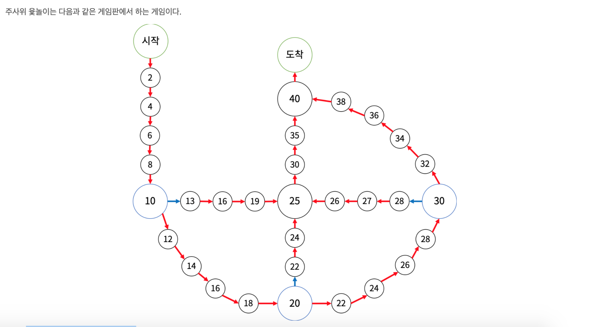

[출처] https://www.acmicpc.net/problem/17825

**문제** 
처음에는 시작 칸에 말 4개가 있다.
말은 게임판에 그려진 화살표의 방향대로만 이동할 수 있다. 말이 파란색 칸에서 이동을 시작하면 파란색 화살표를 타야 하고, 이동하는 도중이거나 파란색이 아닌 칸에서 이동을 시작하면 빨간색 화살표를 타야 한다. 말이 도착 칸으로 이동하면 주사위에 나온 수와 관계 없이 이동을 마친다.
게임은 10개의 턴으로 이루어진다. 매 턴마다 1부터 5까지 한 면에 하나씩 적혀있는 5면체 주사위를 굴리고, 도착 칸에 있지 않은 말을 하나 골라 주사위에 나온 수만큼 이동시킨다.
말이 이동을 마치는 칸에 다른 말이 있으면 그 말은 고를 수 없다. 단, 이동을 마치는 칸이 도착 칸이면 고를 수 있다.
말이 이동을 마칠 때마다 칸에 적혀있는 수가 점수에 추가된다.
주사위에서 나올 수 10개를 미리 알고 있을 때, 얻을 수 있는 점수의 최댓값을 구해보자.

**입력**
첫째 줄에 주사위에서 나올 수 10개가 순서대로 주어진다.

**출력**
얻을 수 있는 점수의 최댓값을 출력한다.

**예제입력1**

    1 2 3 4 1 2 3 4 1 2

**예제출력1**

    190

**예제입력2**

    1 1 1 1 1 1 1 1 1 1

**예제출력2** 

    133

**예제입력3**

    5 1 2 3 4 5 5 3 2 4

**예제출력3**

    214

    