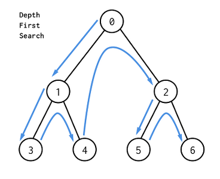

# DFS (깊이 우선 탐색)

## DFS 란

**"깊이우선탐색(Depth First Search) 이란 루트 노드에서 시작해서 다음 분기(branch)로 넘어가기 전에 해당 분기를 완벽하게 탐색하는 방법이다. "**

**그래프 탐색이란** 하나의 정점으로부터 시작하여 차례대로 모든 정점들을 한 번씩 방문하는 것. 

예를 들어 특정도시에서 다른 도시로 갈 수 있는지, 전자회로에서 특정 단자와 단자가 서로 연결되어 있는지를 탐색하는 알고리즘이다.



>  한 방향으로 인접한 노드가 없을 때까지 (가장 깊은 노드까지) 탐색한 뒤 다른 방향으로 탐색을 하는 방식이다.


## DFS 특징 및 장점

- 모든 노드를 탐색해야 할때 활용하기 좋은 방식이다.
- 깊이 우선 탐색(DFS)이 너비 우선 탐색(BFS)보다 좀 더 간단하다.
- 현 경로상의 노드를 기억하기 때문에 적은 메모리를 사용.
- 찾으려는 노드가 깊은 단계에 있는 경우 BFS 보다 빠르게 찾을 수.


## DFS 구현

```plain
DFS(G, u)
    u.visited = true
    for each v ∈ G.Adj[u]
        if v.visited == false
            DFS(G,v)
 
main() 
    For each u ∈ G
        u.visited = false
     For each u ∈ G
       DFS(G, u)
```

### 그림으로 보기


1. A를 시작노드로 한다


2. A에 인접한 B,C를 스택에 넣는다


3. 스택의 맨 위에 있는 C를 꺼내서 Visited 배열에 넣는다. C의 인접한 노드인 D, F가 스택에 넣는다.


4. 스택의 맨 위에 있는 F를 꺼내서 Visited 배열에 넣는다. F에 인접한 노드인 D는 이미 Stack에 있으므로 skip~


5. 스택의 맨 위에 있는 D를 꺼내서 Visited 배열에 넣어~. D에 인접한 C, F는 Visited 배열에 있으며 B는 스택에 있으므로 넘어가


6. 스택의 맨 위에 있는 B를 꺼내서 Visited 배열에 넣어. 스택이 비어있으므로 탐색을 종료!


### 참고) 언제 DFS, BFS로 풀까? 

- 최단 거리 문제를 푼다면 BFS를 사용합니다.
- 이동할 때마다 가중치가 붙어서 이동한다거나 이동 과정에서 여러 제약이 있을 경우 DFS로 구현하는 것이 좋습니다.
- DFS는 스택(혹은 재귀), BFS 큐를 사용합니다.


## DFS 연습 


>  2에서 시작해서 3까지 가는 모든 경로를 print하여라

```python
from collections import defaultdict 

class Graph: 
    def __init__(self, vertices): 
        self.V = vertices  # Node의 개수
        self.graph = defaultdict(list)  

    def addEdge(self, u, v): 
        self.graph[u].append(v) # adjacency list 형태

    def dfs_(self, u, destination, visited, path): 
        visited[u]= True
        path.append(u) 

        if u == destination: 
            print(path)
        else: 
            for i in self.graph[u]: 
                if visited[i]== False: 
                    self.dfs_(i, destination, visited, path) 
        path.pop() 
        visited[u]= False

    def dfs(self, source, destination): 
        visited =[False]*(self.V) 
        path = [] 
        self.dfs_(source, destination, visited, path) 

if __name__ == '__main__':
    # Graph 초기화
    graph = Graph(4) 

    # Graph edge 추가
    graph.addEdge(0, 1) 
    graph.addEdge(0, 2) 
    graph.addEdge(0, 3) 
    graph.addEdge(2, 0) 
    graph.addEdge(2, 1) 
    graph.addEdge(1, 3) 

    source = 2 
    destination = 3
    graph.dfs(source, destination) 
```

