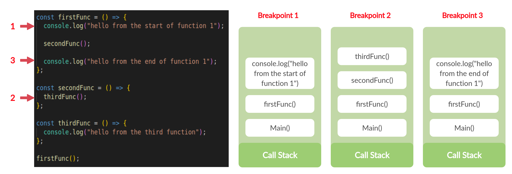
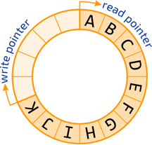

## Stack & Queue

### Stack

* FILO(First in Last Out)의 자료구조

대표적인 stack 쓰임은 함수 호출이죠!


구현 방법
* vector 사용(python list) / 사이즈를 미리 안다면 array로도 같은 방법으로 구현할 수 있음
* single/double linked list

```
class Node {
    public:
        int data;
        Node(int data);
        Node();
        ~Node();
};

class Stack {
    public:
       int size;
       int top;
       Node** nodes;

       Stack(int capacity);
       ~Stack();

       void push(int data);
       int pop();
       bool empty();
       int getSize();
};
```

용도
* 함수호출 알고리즘
* quick sort 
* 미로찾기 알고리즘
* reverse 함수들 (순서를 역순으로 바꾸는 경우)

### Queue

* FIFO(First in First Out)의 자료구조


구현방법
* array - 요소 이동을 수행하기 때문에 복잡도 O(n)
* Ring buffer 이용 - 프론트와 리어값을 업데이트하면서 인큐 디큐를 수행하기 때문에 복잡도 O(1)



용도
* FIFO 속성 때문에 네트워크 버퍼처리 알고리즘
* 너비 우선 탐색(BFS, Breadth-First Search)
* cache 구현

